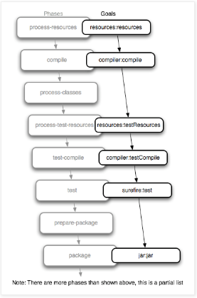

# Maven Goals and Phases

## Maven Build Lifecycle
Maven은 lifecycle에 따라서 project를 배포한다.
Maven에서는 3가지 built-in lifecycle을 제공한다.
- default : project를 배포하는 main lifecycle
- clean : 이전 build에서 생된 모든 파일들을 제거한다.
- site : 문서화를 수행한다.

각각의 Lifecycle은 Phase로 이루어진다.

## Maven Phase
Phase란 Maven의 빌드 과정에서 수행되는 하나의 과정?단계?(stage)를 의미한다.
Phase는 순서에 따라 수행되기 때문에 하나의 Phase를 수행한다고 해서 해당 Phase만 수행되는것이 아니라
해당 Phase의 앞에서 수행되어야 하는 Phase들이 모두 수행된다.
Build Lifecycle의 **빌드 단계와 각 단계의 순서만을 정의**하고 있다.

## Maven Goals
Phase가 순서를 정의 했다면 **Goal은 Phase안에서 실행 될 실제 명령**을 의미한다.
 
## Maven Plugin
Goal들의 모임이다.
Phase에 Goal을 Binding하기 위해 필요하다.
Maven에서 제공하고 있는 모든 기능은 Plugin을 기반으로 동작한다.

## Lifecycle / Phase / Goals 사이의 관계를 나타낸 그림

  

# Reference
- https://m.blog.naver.com/PostView.naver?isHttpsRedirect=true&blogId=remagine&logNo=220726121992
- https://www.baeldung.com/maven-goals-phases